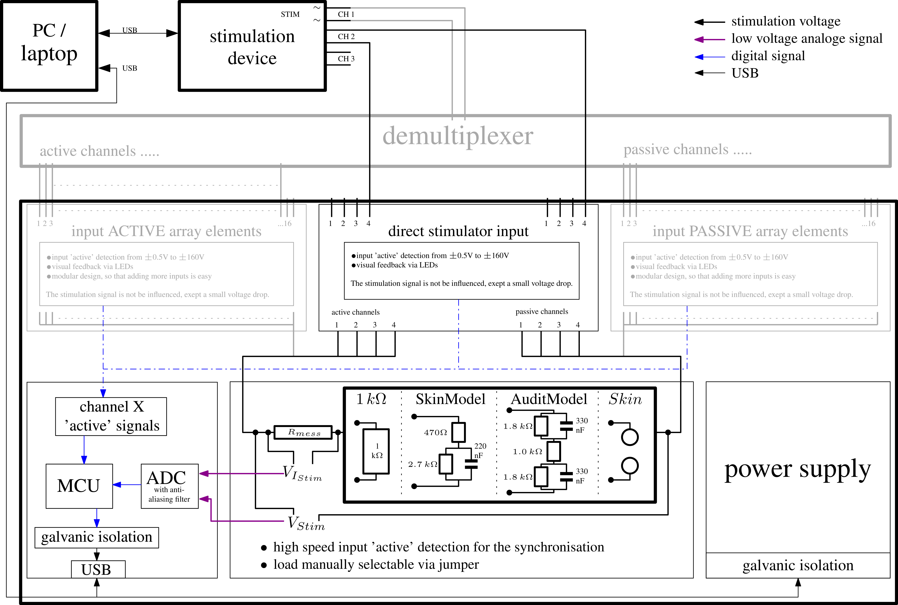

# Testbed for Functional Electrical Stimulation (FES) Devices

## Abstract
The FES Testbed is a specialised data acquisition system for measurements of transcutaneous electrical stimulation setups. The galvanic isolated measurement system transfers the high-resolution data of every detected
stimulation pulse via USB to a PC or Laptop. The stimulation pulse can use one of the 3 included skin replacement
models or can be forwarded to standard electrodes, allowing to record a normal FES application. Modular
postprocessing MATLAB functions round up the FES Testbed. These functions handle the data conversion, pulse
detection, gathering of statistics, data management and data visualisation. A MATLAB GUI for efficient pulse
examination completes the FES Testbed.

<a href="./Documentation/Vienna_FESWS_2019_FES_Testbed__Paper.pdf">More Information ...</a>

